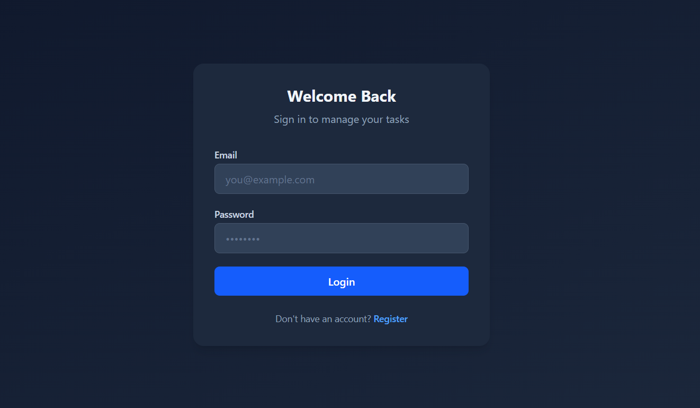
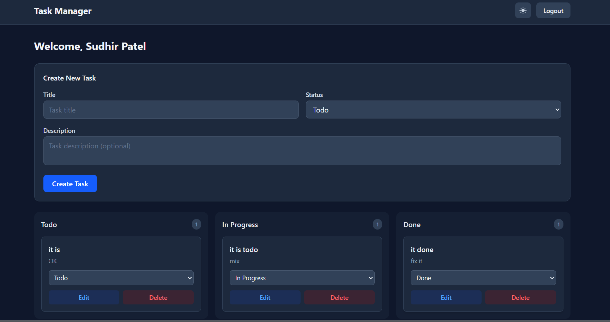

# Task Manager Frontend

A responsive task management frontend built with React and Vite that supports user authentication and task workflows across Todo, In Progress, and Done stages. Features optimized UI with loading states and comprehensive error handling.

[](https://react.dev)
[](https://vitejs.dev)
[](https://tailwindcss.com)
[](https://nodejs.org)

## Table of Contents

- [Project Overview](#1-project-overview)
- [Features](#2-features)
- [Tech Stack](#3-tech-stack)
- [Prerequisites](#prerequisites)
- [Project Structure](#4-project-structure)
- [Assumptions](#5-assumptions)
- [Technical Decisions](#6-technical-decisions)
- [Screenshots](#8-screenshots)
- [Demo Video](#demo-video)
- [Installation](#9-installation-and-setup-instructions)
- [Environment Setup](#10-environment-variables)
- [Running Locally](#11-running-locally)
- [Build & Deployment](#12-production-build-instructions)
- [API Reference](#api-reference)
- [Troubleshooting](#troubleshooting)
- [Future Improvements](#14-future-improvements)

## Prerequisites

- Node.js 20+
- npm or yarn
- Backend API running on `http://localhost:8080` (development)

## 1. Project Overview

This project is the frontend client for a full-stack Task Manager application. It integrates with a Spring Boot REST API to manage user accounts and tasks, and it maintains user session context in localStorage for a smooth experience.

**Backend Repository:** https://github.com/sudhirskp/taskManager

**Live Demo:** Deployed on Netlify

## 2. Features

- User registration and login
- Create, update, and delete tasks
- Task workflow across Todo, In Progress, and Done
- User-specific task management
- Responsive layout across devices
- Loading and error states for API calls
- Session persistence with localStorage
- Protected routes for authenticated users

## 3. Tech Stack

- React
- Vite
- Tailwind CSS
- React Router
- Axios

## 4. Project Structure

```
public/
	favicon.ico
	login.png
	dashboard.png
src/
	api/
		axios.js
	components/
		Navbar.jsx
		TaskCard.jsx
		TaskColumn.jsx
		TaskForm.jsx
	pages/
		Dashboard.jsx
		Login.jsx
		Register.jsx
	services/
		authService.js
		taskService.js
	App.jsx
	index.css
	main.jsx
```

## 5. Assumptions

- The backend exposes stable REST endpoints under `/api`.
- Users are uniquely identified and returned by the auth API.
- LocalStorage is available for session persistence.
- CORS is configured on the backend to accept frontend requests.

## 6. Technical Decisions

- Axios instance with `VITE_API_URL` for centralized API configuration.
- React Router for client-side navigation.
- Tailwind CSS for rapid UI iteration and consistent design.
- localStorage for session management (suitable for single-user session).
- Component-based architecture for reusability and maintainability.

## 7. Tradeoffs

- LocalStorage is used for simplicity; a more secure token strategy could be used in production.
- No global state library to keep the codebase lightweight.
- Client-side only filtering; server-side pagination recommended for large datasets.

## 8. Screenshots

### Login



### Dashboard



## Demo Video

📹 **Watch the demo:** [Google Drive Video Link](https://drive.google.com/file/d/1t4N4FzrXshEEXcHRUab5A4pXHGmdlv6C/view?usp=sharing)

## API Reference

### Authentication

- `POST /api/auth/register` - Register new user
- `POST /api/auth/login` - Login user

### Tasks

- `GET /api/tasks/:userId` - Get user tasks
- `POST /api/tasks` - Create task
- `PUT /api/tasks/:taskId` - Update task
- `DELETE /api/tasks/:taskId` - Delete task

## 9. Installation and Setup Instructions
**Example .env.example file is provided in the repository.**

## 11. Running Locally

```bash
npm run dev
```

App runs at `http://localhost:5173`. Open your browser and navigate to that URL.

**Ensure the backend API is running before using the app.**
npm install
```

## 10. Environment Variables

Create a `.env` file in the project root:

```bash
VITE_API_URL=http://localhost:8080
```

## 11. Running Locally

```bash
npm run dev
```

App runs at `http://localhost:5173`.

## 12. Production Build Instructions

Output is generated in the `dist/` directory, ready for deployment.

## 13. Deployment Information

- Frontend is deployed on Netlify.
- Configure `VITE_API_URL` in the Netlify environment variables to point to the backend.
- Environment variables are injected at build time.

### Netlify Deployment

1. Push code to GitHub
2. Connect repository to Netlify
3. Set build command: `npm run build`
4. Set publish directory: `dist`
5. Add environment variable: `VITE_API_URL` = `<backend-url>`
6. Deploy

## Troubleshooting

### CORS Errors
- Ensure backend CORS is configured to accept requests from your frontend domain.

### 401 Unauthorized
- Check if user session is stored in localStorage.
- Verify backend auth endpoint is reachable.

### API Calls Failing
- Verify `VITE_API_URL` environment variable is set correctly.
- Check backend is running and accessible.
- Use browser DevTools to inspect network requests
## 13. Deployment Information

- Frontend is deployed on Vercel.
- Configure `VITE_API_URL` in the Vercel environment variables to point to the backend.

## 14. Future Improvements

- Add role-based access and finer-grained permissions
- Add drag-and-drop for task status changes
- Add pagination and filtering for large task lists
- Add refresh token strategy for improved session security
